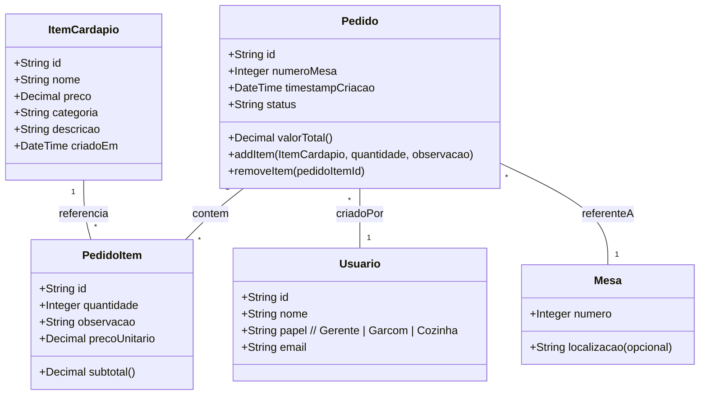

# Sistema de Gestão de Pedidos para Restaurante — Pequeno Bistrô Sabor Local

## Contextualização

O *Pequeno Bistrô Sabor Local* anota pedidos em papel e os leva para a cozinha. Isso causa perda de informações (papéis extraviados), problemas de legibilidade e a cozinha não sabe a ordem correta de atendimento — gerando atrasos, confusão e insatisfação do cliente.

O objetivo deste projeto é substituir o processo manual por um sistema simples e eficiente que organize pedidos, melhore a comunicação entre salão e cozinha e registre faturamento básico.

## Solução proposta (visão geral)

Criar uma aplicação web com três perfis principais: **Gerente**, **Garçom** e **Cozinha**.

Fluxo principal:

1. O Gerente cadastra itens do cardápio (nome, preço, categoria).
2. O Garçom cria pedidos, informa o número da mesa, adiciona itens e envia o pedido para a cozinha.
3. A Cozinha acessa a tela "Cozinha" que lista apenas os pedidos no status **Recebido** em ordem de chegada (primeiro a entrar = primeiro a mostrar).
4. A Cozinha atualiza o status para **Em Preparo** e depois para **Entregue** quando finalizado.
5. O Gerente visualiza todos os pedidos e o faturamento (soma dos valores de pedidos entregues, com filtros por período).

Funcionalidade bônus: cálculo automático do valor total do pedido (somatória dos itens × quantidades + observações se houver).

## Requisitos Funcionais

1. **CRUD de Itens do Cardápio**

   * Criar, ler, atualizar e excluir itens do cardápio.
   * Cada item: `id`, `nome`, `preco` (decimal), `categoria` (entrada, prato principal, sobremesa, bebida, etc).

2. **Gerenciamento de Pedidos**

   * Criar pedido novo com: `id`, `numeroMesa`, `itens` (lista de `PedidoItem` contendo referência ao `ItemCardapio`, `quantidade`), `status` (Recebido | Em Preparo | Entregue).
   * Adicionar e remover itens antes de enviar para cozinha.
   * Enviar pedido para a cozinha (define `status = Recebido` e registra `timestamp` de chegada).

3. **Tela Cozinha**

   * Lista pedidos com `status = Recebido` ordenados por `timestampCriacao` (ordem de chegada).
   * Permite a cozinha alterar o status para `Em Preparo` e depois `Entregue`.

4. **Visão do Gerente**

   * Visualizar todos os pedidos (filtros por status e período).
   * Ver faturamento total por período (por exemplo: hoje, semana, mês) — soma dos `valorTotal` de pedidos entregues.

5. **Cálculo de Valor do Pedido (Bônus)**

   * Cada pedido deve expor um campo calculado `valorTotal = Σ (item.preco × quantidade)`.

## Requisitos Não-Funcionais

* **Simplicidade e usabilidade**: interface clara, botões grandes para uso em tablets ou telas da cozinha.
* **Desempenho**: resposta rápida para criação e listagem de pedidos (páginas da cozinha devem atualizar com frequência para novos pedidos).
* **Confiabilidade**: evitar perda de dados; persistência em banco de dados leve.
* **Segurança básica**: autenticação simples por papel (Gerente / Garçom / Cozinha); validação de entradas no backend.


## Modelagem e Diagrama de Classes



## Diagrama de Casos de Uso

```mermaid

    %% Atores
    actor Garcom as "Garçom"
    actor Cozinha
    actor Gerente

    %% Casos de uso
    (Realizar pedido)
    (Adicionar item ao pedido)
    (Remover item do pedido)
    (Alterar quantidade do item)
    (Enviar pedido para cozinha)
    (Atualizar status do pedido)
    (Preparar pedido)
    (Entregar pedido)
    (Gerenciar cardápio)
    (Visualizar relatórios)
    (Login / Autenticação)

    %% Associações
    Garcom --> (Realizar pedido)
    Garcom --> (Adicionar item ao pedido)
    Garcom --> (Remover item do pedido)
    Garcom --> (Alterar quantidade do item)
    Garcom --> (Enviar pedido para cozinha)

    Cozinha --> (Preparar pedido)
    Cozinha --> (Atualizar status do pedido)
    Cozinha --> (Entregar pedido)

    Gerente --> (Gerenciar cardápio)
    Gerente --> (Visualizar relatórios)

    %% Relações entre casos de uso
    (Realizar pedido) ..> (Adicionar item ao pedido) : <<include>>
    (Realizar pedido) ..> (Remover item do pedido) : <<include>>
    (Realizar pedido) ..> (Alterar quantidade do item) : <<include>>
    (Enviar pedido para cozinha) ..> (Atualizar status do pedido) : <<include>>
    (Preparar pedido) ..> (Atualizar status do pedido) : <<include>>

    ```

## Materiais Utilizados

1. Banco: MongoDB — tabelas: itens, pedidos, pedido_items, usuarios, mesas.
2. Next + API Routes — páginas para Gerente, Garçom e Cozinha e rotas básicas descritas acima.
3. Sistema Operacional — Windows 11

## Acesso de Login

- Gerente - Senha: gerente123
- Garçom - Senha: garcom123

### Link Protótipo Figma

- https://www.figma.com/design/zJQQMcfR0YbetZWRZiGxgC/Untitled?node-id=0-1&t=HD38VQpEIknod6Y6-1

